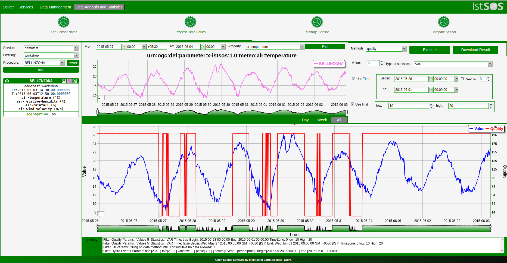
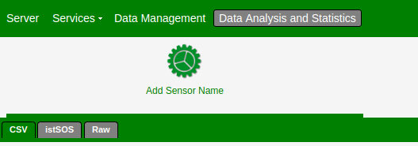

# istSOS-Data Analysis and statistical tool suite (GSoC 2017)
> istsos2 provides easily manage your sensor network and distribute your data in a standard way.

>Mentors : [@massimiliano-cannata](https://github.com/massimiliano-cannata), [@mantonovic](https://github.com/mantonovic)

## Summary

The primary goal of my project was to create `OAT(Data analysis and statistics)` extension in RESTFull Web api and `OAT extension` having data analysis and statistical tools for `istSOS` which is be used to automate the creation of statisticate documents using OAT library and harvesting the data from an istSOS server.

[Implemented OAT methods](https://github.com/rahulworld/Data-analysis/blob/master/examples/README.md)

---
### istSOS

istSOS is an OGC SOS server implementation written in Python. istSOS allows for managing and dispatch observations from monitoring sensors according to the Sensor Observation Service standard.

The project provides also a Graphical user Interface that allows for easing the daily operations and a RESTful Web api for automatizing administration procedures.

[Developers docs](http://istsos.org/en/latest/doc/#developers-docs)

---

### OAT(Observation Analysis Tool)

`OAT` is a Python package which is integrated in the istSOS through an interface exposing its features to modellers and non programmer users. OAT library Method class which is designated to represent a processing method. The library applies the behavioral visitor pattern which allows the separation of an algorithm from the object on which it operates.

From a dependency point of view, OAT takes advantage of the (McKinney, 2010),  and  (Van der Walt et. al. 2011) packages.

[OAT](http://www.freewat.eu/)

---

## Tools Used

1. [Pandas](http://pandas.pydata.org/)
2. [NUMPY](http://www.numpy.org/)
3. [SCIPY](https://www.scipy.org/)
4. [d3.js](https://github.com/ruby-prof/ruby-prof)

# Challenges
1. Understanding istSOS structure and OAT package
2. Working with extjs tools in a concurrent environment.
3. Developing consistent suits.

# Scope for future improvements
1. fuctionality add sensor through (CSV, istSOS, Raw)data in `Add sensor name` GUI in `OAT extenstion`.

2. fuctionality add in `Mangae sensor`.
3. functionalty add in `Compare sensor`.

# Commits

###Data analysis and statistics tool suit Pool

[pull request](https://github.com/istSOS/istsos2/pull/24)

[forked github Repo.](https://github.com/rahulworld/istsos2/tree/oat)

[Data analysis and statistics tools suit commits](https://github.com/rahulworld/Data-analysis/commits/master)

###Data analysis and statistics tool suit

[Updated OAT methods](https://github.com/rahulworld/Data-analysis/commit/8ab10fbb74331fe5ad85237e14996a2b207be79d)

[Added multiple y-axis in Dygraph](https://github.com/rahulworld/Data-analysis/commit/d6b25967fd46c4c7c4f371376089f8d9f212d0a0)

[Added download result](https://github.com/rahulworld/Data-analysis/commit/dfa2c7e131c3b1a899ddd1a25291fe2e9c5a339d)

[Added tabulation](https://github.com/rahulworld/Data-analysis/commit/bd434114a6c6bf66031de56d067f00e09fa41ff1)

[Added usage of period](https://github.com/rahulworld/Data-analysis/commit/c61b096af2f8dc12257caa0d20279584e1dffbf0)

[Added usage of time](https://github.com/rahulworld/Data-analysis/commit/d3ba63b7ab9fd7011b66903c85b4dcf2af723b41)

[Added hargreaves oat method](https://github.com/rahulworld/Data-analysis/commit/2972711b9db4ed50d840cb7862bcd4743b804683)

[Added data_values oat method](https://github.com/rahulworld/Data-analysis/commit/a681def7a961d243e4bcef6d8634c81d21a47eb5)

[Added quality oat method](https://github.com/rahulworld/Data-analysis/commit/655069f461243cfd96774bc1cd85ad8192867d02)

[Added fill oat method](https://github.com/rahulworld/Data-analysis/commit/15bf91e0a7a7338813fed5f014125b6b4ac583da)

[Added statistics oat method](https://github.com/rahulworld/Data-analysis/commit/8e380f6f0b1acf38ac85beeea8ed97cf696fe610)

[Added hydro_indicies oat method](https://github.com/rahulworld/Data-analysis/commit/8f8795257dbc399d93ad1eb20f7d3c60c41f9319)

[Added intgrate oat method](https://github.com/rahulworld/Data-analysis/commit/ccf52ee83a4cc445c5774c3599f7e36cc38a170e)

[Added hydro_events oat method](https://github.com/rahulworld/Data-analysis/commit/2b7b36ea0efe0d22b02c95b19e33826982bf545a)

[Added hydro_separation oat method](https://github.com/rahulworld/Data-analysis/commit/4a347d800660ccd612f8493ce2f38b14491ae286)

[Added exeedance oat method](https://github.com/rahulworld/Data-analysis/commit/dde68648c26928d27d728a793ffd8cf946adfddd)

[Added resample oat method](https://github.com/rahulworld/Data-analysis/commit/1083c47c0ded0e7aaf285ea14041ae194b72aa27)

[Added some OAT methods GUI](https://github.com/rahulworld/Data-analysis/commit/7096bc88ceb2ab493ce915f6420b8855cfcfba43)

[Added page Add Sensor GUI](https://github.com/rahulworld/Data-analysis/commit/48173aa5ed562987bc5d0dee429bb060845181a0)

[Added page Process time series GUI](https://github.com/rahulworld/Data-analysis/commit/b9269e911eab22a36dbfffc653abb7efcbebbba8)

##Other Links
* [Images and documentation](https://github.com/rahulworld/Data-analysis/blob/master/examples/README.md)
* [Wiki](https://wiki.osgeo.org/wiki/GSoC_17:_istSOS-Data_analysis_and_statistical_tools_suite)
* [Blog](https://rahulworld.github.io/GSoC.html)
* [Github](https://github.com/rahulworld)